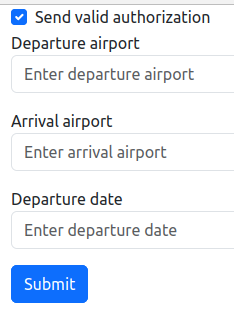
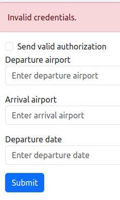
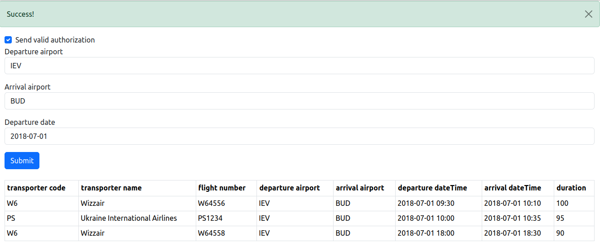

## Тестове завдання
### Локальний запуск
Для підготовки середовища потрібно
* Склонувати локально git репозиторій
* Виконати наступні bash команди в папці репозиторію
```shell
composer install
npm install
cp .env.example .env
php artisan key:generate
```
* В файлі `.env` налаштувати реквізити доступу до БД
* Виконати
```shell
php artisan migrate --seed
```
Тепер середовище готове до використання.

Запустити його можна виконавши команду
```shell
php artisan serve
```
### Робта з середовищем
Щоб потрапити в середовище необхідно перейти в браузері за адресою http://localhost:8000/

Головна частина сторінки вигдялає так



На ній присутні всі поля вводу, що описані в тестовому завданні.
Також доданий `checkbox` з написом `Send valid authorizataion` для додавання правильних даних авторизації.
Або відключення. В цьому випадку виникне помилка



При заповненні всіх полів даними, що були запропоновані в тестовому завданні як приклад роботи АПІ, отримаємо результат


